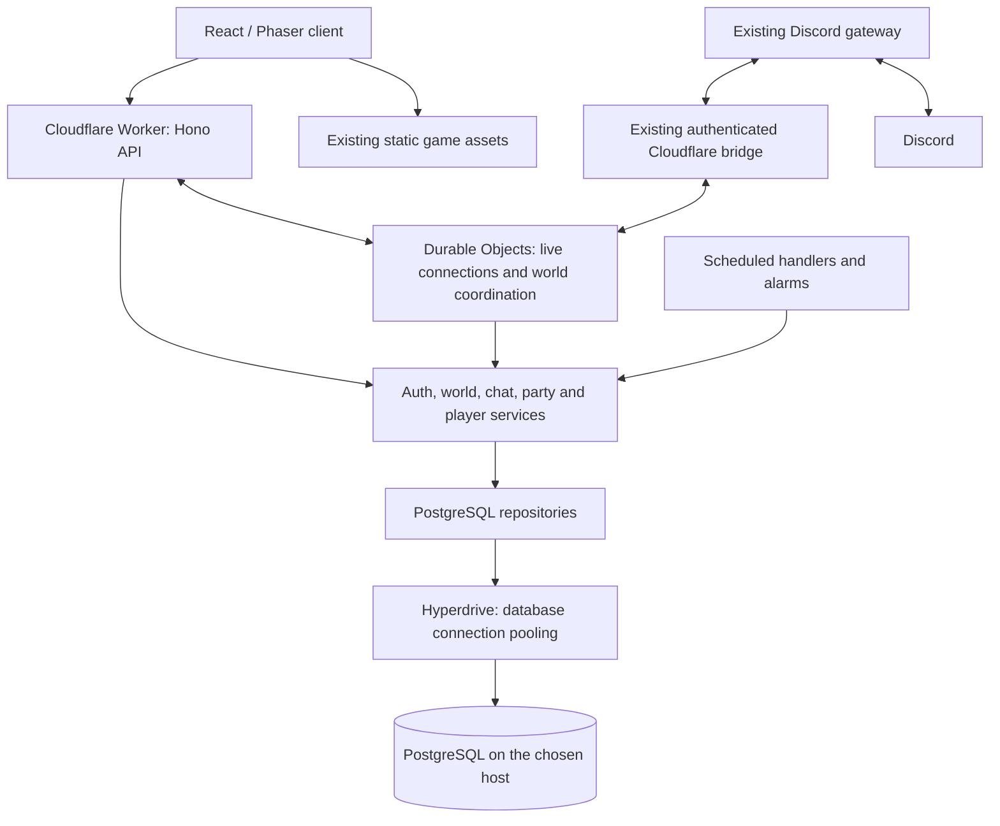

# Backend and database architecture

Status: agreed direction, implementation deferred. Updated September 17, 2026.

**Build the game world and its functionality first. Implement this architecture
after that work is ready and the database/backend work is resumed.** This document
records the plan; the migration has not started. Do not provision services, change
the live database or replace the backend as part of documenting it.

## Decision in plain language

- Keep Cloudflare running the existing backend and live connections.
- Use standard PostgreSQL for durable application data, hosted separately.
- Introduce Hono gradually to organize the API inside the existing Worker.
- Separate database access from game rules so PostgreSQL can move between hosts.
- Keep the existing Discord gateway and Discord sign-in.

No new VPS backend is required. Hono organizes code; Cloudflare runs it; PostgreSQL
stores permanent data. This replaces the earlier proposal to make a containerized
Node.js backend the required destination. Moving the entire backend off Cloudflare
remains an optional future project.

## Target stack and topology

| Component            | Planned choice                                                | Responsibility                                                            |
| -------------------- | ------------------------------------------------------------- | ------------------------------------------------------------------------- |
| Browser              | Existing React/Phaser application                             | Rendering, input and presentation                                         |
| HTTP backend         | TypeScript, Hono and Zod on Cloudflare Workers                | APIs, authentication and request validation                               |
| Live runtime         | Existing Cloudflare Durable Objects behind runtime interfaces | WebSockets, online presence and world coordination                        |
| Application services | Shared backend modules                                        | Auth, world, chat, party and player rules                                 |
| Durable database     | Standard PostgreSQL on the chosen host                        | Application records, transactions and retained history                    |
| Database access      | PostgreSQL repositories using `pg`, versioned SQL migrations  | SQL, transaction boundaries and portable schema                           |
| Connection pooling   | Cloudflare Hyperdrive                                         | Connect Workers and Durable Objects to external PostgreSQL                |
| Scheduled work       | Worker scheduled handlers and Durable Object alarms           | Invoke shared job/retry services; durable work records live in PostgreSQL |
| Discord integration  | Existing `apps/gateway` and authenticated bridge              | Discord events, access updates, channel chat and voice integration        |
| Frontend hosting     | Existing Cloudflare static assets deployment                  | Serve the game and versioned assets                                       |

Hono runs on Cloudflare Workers and also supports Node.js. Using it does not
require a second API server or make Durable Object code automatically portable.
[Hono documentation](https://hono.dev/docs)



Hyperdrive connects to external PostgreSQL using supported database drivers. It
does not replace or own the PostgreSQL database. A later host change retains the
schema and repositories when the destination supports the PostgreSQL features and
versions we use. [Hyperdrive documentation](https://developers.cloudflare.com/hyperdrive/)

Choose a database region based on measured latency from the active world runtime.
Connection pooling reduces connection overhead, but database round trips still
take time. Keep high-frequency movement updates out of the database write path.

Disable Hyperdrive query caching initially for application data. Auth, permissions,
party membership and chat history need current reads. Pooling remains useful with
query caching disabled. Any later caching must have explicit consistency rules.
[Query caching documentation](https://developers.cloudflare.com/hyperdrive/concepts/query-caching/)

## Code boundaries

Keep one repository and build on the existing `worker/`, `src/` and `apps/gateway/`
structure. A bulk folder move, separate API deployment or microservices split is
not a prerequisite. The logical boundaries are:

```text
HTTP routes / WebSocket handlers
    -> Application services: auth, worlds, chat, parties, players
        -> Repository and transaction interfaces
            -> PostgreSQL implementation
        -> Runtime interfaces
            -> Cloudflare connections, coordination, bridge and scheduling
```

- Routes validate input, derive the authenticated player and call services.
- Services implement rules without importing Hono contexts, Cloudflare bindings,
  PostgreSQL clients or environment variables.
- Repositories own SQL, indexes, row mapping and database errors.
- Repository interfaces are asynchronous, including transitional adapters.
- Runtime interfaces isolate connection delivery, scheduling and world coordination.
- A small composition layer injects repositories, runtime adapters and configuration.
- The browser imports safe shared contracts and game rules, never backend
  repositories, database credentials or bot secrets.

Use meaningful operations such as `appendMessage`, `acceptInvitation` and
`saveWorldRevision`, rather than hiding transaction requirements behind generic
key/value methods. The same PostgreSQL implementation should work across hosts;
there is no separate adapter for every hosting provider.

A transaction boundary supplies repositories bound to the same PostgreSQL client
and transaction. Keep transactions short, apply timeouts and release connections
after each request/event using the supported Workers connection lifecycle. Do not
copy a permanent Node process-wide connection pool into Worker code.
[Transaction documentation](https://node-postgres.com/features/transactions),
[Workers PostgreSQL driver guidance](https://developers.cloudflare.com/hyperdrive/examples/connect-to-postgres/)

## Durable data and runtime state

PostgreSQL becomes the source of truth for:

| Module      | Persistent records                                                                                 |
| ----------- | -------------------------------------------------------------------------------------------------- |
| Auth        | Users, Discord identities, hashed sessions, encrypted OAuth credentials and revocation             |
| Worlds      | Guild/world records, saved layouts, channel allocations, versioned documents and checksums         |
| Chat        | Conversations, participants, retained messages, ordering and request deduplication                 |
| Parties     | Parties, membership, invitations, acceptance/decline and expiry                                    |
| Players     | Saved appearance/location; inventory and progression once authoritative persistence is implemented |
| Jobs/events | Pending work, retries, leases and committed events awaiting publication                            |

Move durable application records out of D1, Durable Object storage and any KV
records that are the only saved copy. **Replacing D1 alone does not migrate chat:**
the current chat store uses SQLite inside a Durable Object.

Durable Objects remain responsible for live sockets and coordination. They may keep
platform metadata such as alarms and socket attachments, plus reconstructable
runtime state. Those records must not be the only copy of messages, parties,
inventory or saved worlds. KV may remain an optional cache of PostgreSQL records.

Scope world-owned records to their world/guild and enforce foreign keys, uniqueness
and appropriate checks. Membership changes must validate party capacity, invitation
expiry and existing membership in one transaction. Use operation IDs to prevent
duplicate message creation or duplicate rewards on retries.

Moving queries to external PostgreSQL introduces asynchronous boundaries. Durable
Object handlers can interleave while waiting on network I/O; do not assume the old
synchronous SQLite implementation still protects an entire operation. PostgreSQL
transactions, constraints and consistent lock ordering enforce the invariants.

Keep world documents versioned and preserve existing identifiers and checksums.
Database migration must not regenerate towns or reset player progress. Persist
position checkpoints at controlled intervals and transitions, not every frame.

The demo's combat, inventory and journey state are not yet a completed
server-authoritative multiplayer progression system. Reassess the implementation
when this project resumes. Validate gameplay actions and reward ownership on the
backend before treating client-submitted progress as trusted durable data.

## Chat reliability and scheduling

Keep World chat scoped to the current server's world, Party chat scoped to current
members, and Direct chat scoped to its participants. Preserve the client protocol
and reconnect behavior where possible.

1. Authenticate using the existing Discord-backed Dmap session and check access.
2. In one PostgreSQL transaction, validate membership, allocate the conversation's
   next sequence, insert the message and record an event for delivery.
3. Acknowledge only after commit. A duplicate request returns the original result.
4. Deliver through the owning Durable Object to currently authorized recipients.
5. Recover missed messages from PostgreSQL using conversation cursors on reconnect
   and periodic synchronization.

The pending-event table is an outbox: the message and the need to publish it are
committed together. Delivery may repeat, so clients deduplicate by message ID and
sequence. Allocate per-conversation sequences under a transaction lock; a global
sequence by itself does not guarantee transaction commit order.

Membership changes and message writes must share an appropriate locking policy,
with current access checked again for delivery and history reads. Keep the existing
seven-day / 500-message retention policy explicit and configurable unless gameplay
requirements have changed by implementation time.

Use alarms for prompt retries and a scheduled PostgreSQL scan as a recovery path
for committed work whose initial wake-up failed. Claim bounded batches with leases
and route events through the owning Durable Object. Jobs must remain retryable
after restarts; a process-local timer or a best-effort background promise alone is
not a durable delivery guarantee.

Use the existing Durable Object ownership model for live worlds. Keep the ability
to replace that runtime behind interfaces, but do not build a second Node runtime,
Redis deployment or distributed VPS ownership system for this migration.

## Authentication and Discord

Retain Discord sign-in and Dmap's own authenticated session. Continue server-side
permission checks, secure HttpOnly cookies, session expiry/revocation, WebSocket
origin checks, CSRF protection for writes and account-level rate limits.

Keep the existing gateway process, bridge protocol and guild permission updates.
The database migration does not inherently require relocating the gateway or
replacing `DiscordGatewayBridge`. Preserve bounded authorization leases and
fail-closed behavior when server access cannot be verified. Native game messages
remain independent of Discord's message delivery API.

Preserve identifier-derivation and encryption secrets when migrating records so
existing world IDs and encrypted credentials remain usable. Credentials belong in
backend configuration, never in browser bundles or the architecture document.

## Hosting, cost and operations

Continue the existing Cloudflare build/deployment workflow. Introduce Hono and
PostgreSQL incrementally within it, with isolated staging bindings and databases.
Do not buy a VPS or introduce a separate backend hosting bill solely for this plan.

Choose a PostgreSQL host when implementation resumes. Managed PostgreSQL or a
compatible self-hosted instance are both options; self-hosting adds responsibility
for patching, backups and recovery. Configure verified TLS and controlled network
access for Hyperdrive. Do not expose an unrestricted database for convenience.

Budget for Cloudflare Workers, Durable Objects and the PostgreSQL host. Hyperdrive
has plan-specific allowances. Cloudflare's entry price is not a guaranteed total:
active world duration, connection traffic and storage affect usage. Recheck pricing
and measure representative gameplay before choosing plans or estimating a bill.
[Workers pricing](https://developers.cloudflare.com/workers/platform/pricing/),
[Durable Objects pricing](https://developers.cloudflare.com/durable-objects/platform/pricing/),
[Hyperdrive pricing](https://developers.cloudflare.com/hyperdrive/platform/pricing/)

Operational requirements for the eventual migration:

- Versioned SQL migrations run as a controlled release step, not on every request.
- PostgreSQL repository tests against a real disposable database.
- End-to-end checks for login, world loading, private chat, parties and reconnects.
- Logs without tokens, credentials or message bodies; metrics for database latency,
  active worlds, reconnects, failed jobs and pending-delivery age.
- Encrypted backups outside the database host and regular restore rehearsals.
- Explicit recovery targets, with point-in-time recovery if ordinary backup
  intervals allow too much data loss.
- Additive schema changes during rollout and a tested rollback procedure that
  accounts for writes already accepted by the new database.

Database host portability depends on supported PostgreSQL features and versions,
tested backups and a controlled write cutover. It does not mean copying only a
connection string while leaving the data behind.
[PostgreSQL backup documentation](https://www.postgresql.org/docs/current/backup-dump.html)

## Delivery plan after the game world and functionality

**This work is deferred. Continue game development first.** When it is resumed:

1. Recheck the current implementation, data inventory, hosting options and pricing.
   Choose the PostgreSQL host, region and recovery targets.
2. Extract service, repository and runtime boundaries; introduce Hono gradually
   inside the Worker while preserving existing APIs and authentication behavior.
3. Implement PostgreSQL schema/migrations and repositories, then configure
   Hyperdrive and the required Workers driver compatibility. Disable query caching
   for application data. Validate locally and on isolated staging.
4. Replace durable D1/SQLite/KV application storage with those repositories. Keep
   Durable Objects for connections and world coordination. Add durable retry and
   recovery paths for message delivery and scheduled jobs.
5. Build protected, resumable export/import tooling for every relevant data source,
   including inactive worlds. Inventory stored world records and Durable Object
   namespaces rather than exporting only currently connected worlds.
6. Preserve IDs, secrets, document versions, message order, party membership and
   existing saved state. Validate imported counts, relationships and checksums.
   Set imported sequence counters above retained message sequences.
7. Rehearse with real clients: concurrent party joins, duplicate sends, private
   access revocation, reconnects, restart recovery, restored worlds and gateway
   permission updates. Measure database round-trip latency and pool usage.
8. Schedule a short initial migration window. Pause mutations across APIs, sockets,
   jobs and gateway-triggered writes; export the final state; import and verify;
   activate the PostgreSQL-backed Worker and Durable Object code; reconnect clients
   and resume writes. Prevent old code from continuing to write legacy stores.
9. Keep old data protected through verification. After PostgreSQL accepts new
   writes, rolling back requires reconciliation or a forward fix; simply routing
   traffic to stale legacy data would lose those new writes. Remove obsolete
   storage code and bindings only after verification and the rollback window.

Do not commit to production cutover timing until the game work and migration
rehearsal are ready. Updating this document does not authorize that cutover.

## Moving later

| Later change                                             | Required work                                                                                                                                     | Application impact                                                             |
| -------------------------------------------------------- | ------------------------------------------------------------------------------------------------------------------------------------------------- | ------------------------------------------------------------------------------ |
| Move PostgreSQL to another managed host                  | Transfer and verify data, configure TLS/access, update Hyperdrive's origin settings and coordinate a write cutover                                | Same schema and repositories when PostgreSQL features/versions are compatible  |
| Move PostgreSQL to a DigitalOcean droplet or another VPS | Same database migration, plus operate PostgreSQL and its backups on that server                                                                   | Cloudflare backend and game features continue using the same repositories      |
| Change Cloudflare plan                                   | Review usage, limits and billing                                                                                                                  | No database migration inherent in changing the plan                            |
| Move the entire backend off Cloudflare                   | Implement and validate a Node runtime for connections, scheduling, world ownership and the Discord bridge; configure hosting and traffic handover | Separate future project; reuse services, contracts and PostgreSQL repositories |
| Change database engine                                   | Design new schema/transaction mappings and migration tools                                                                                        | Requires more work than changing PostgreSQL hosts                              |

Hono reduces HTTP framework changes if a full backend move is chosen later. It
does not replace Durable Object semantics. Keeping those dependencies isolated
makes that option manageable without promising a configuration-only backend move.

## Completion criteria for the deferred migration

- Production game APIs and live connections continue to run on Cloudflare.
- Durable application records use PostgreSQL; legacy stores are no longer their
  only saved copy. Runtime-only platform metadata may stay in Durable Objects.
- Hono organizes the API and services use explicit storage/runtime boundaries.
- Existing worlds, IDs, sessions, chat privacy and Discord integration still work.
- A backup is restored to a second compatible PostgreSQL environment and an
  isolated Cloudflare deployment works with it by changing connection settings,
  without rewriting game features or repositories.
- Migration, recovery, authorization and repository checks pass, and the operational
  procedure is recorded before legacy application storage is retired.

The target is a portable database and an organized backend on the existing host.
Running without Cloudflare is not an acceptance requirement for this work.
